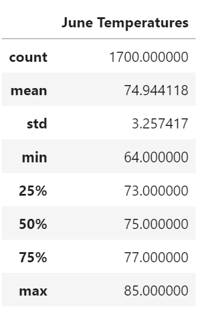
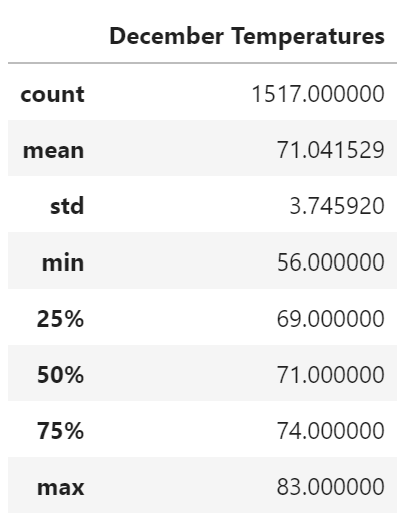

# surfs_up
Analysis of weather to ensure that the new venture of setting up a surf and shake shop serving surf boards and ice cream to locals and tourist is successful. Analysis done using tools like Jupyter Notebook and SQLite.

## 1. Overview of the analysis: The purpose of this analysis :
Analysis of weather to ensure that the new venture of setting up a surf and shake shop serving surf boards and ice cream to locals and tourist is successful. Analysis done using tools like Jupyter Notebook and SQLite.
	In order to set up this new venture, W.Avy who is an expert in surfing and businesses related to surfing is willing to invest in this business. Before he invests, he wants to make sure that we have enough analysis to prove that this business is going to be successful in the long run. 
	We have conducted the analysis on the weather dataset using tools like SQLite, Python Dataframe and SQLalchemy.
## 2. Results: 
### Deliverable 1 : Summary Statistics for June
As most of people plan vacation during summer, we want to check the temperature fluctuations and understand whether Oahu is a great vacation place during June. Hence, we ran the analysis on the temperature in Oahu during June. We concluded the following:

1.	Data : As we ran our analysis filtering the temp records for June. We found that we had 1700 records, which is a good enough number for us to understand about the temperature in the month of June in Oahu.
2.	As per our calculation, we found that the mean (average) temperature in June is Oahu is around 74 degrees.
3.	Also, we found the 25 percentile and 75 percentile temperature records were 73 degrees and 77 degrees. Also, the Max temperature that was recorded in the month of June for Oahu was 85 degrees which was neither too hot nor too cold for surfing as well as for ice-cream sales.
4.	Final conclusion was that Oahu is a great place for surfing in the month of June.

### Deliverable 2: Summary Statistics for December
Another popular time for planning vacation is during winter holidays, so we wanted to also check the temperature fluctuations and understand whether Oahu is a great vacation place during December. Hence, we ran the analysis on the temperature in Oahu during December. We concluded the following :

1.	Data : As we ran our analysis filtering the temp records for December. We found that we had 1517 records, which is a good enough number for us to understand about the temperature in the month of December in Oahu.
2.	As per our calculation, we found that the mean (average) temperature in December is Oahu is around 71 degrees.
3.	Also, we found the 25 percentile and 75 percentile temperature records were 69 degrees and 74 degrees. Also, the Max temperature that was recorded in the month of December for Oahu was 83 degrees which was neither too hot nor too cold for surfing as well as for ice-cream sales. The min temperature recorded was 69 degrees which is again not too cold.
4.	Final conclusion was that Oahu is a great place for surfing in the month of December.

### 3. Summary: Provide a high-level summary of the results and two additional queries that you would perform to gather more weather data for June and December.
As per our above analysis, it proves that Oahu has great weather for both surfing as well as for ice-cream sales. Especially the most popular vacation months being June and December, both have a favorable weather.
In the above analysis, it would be great if we could the following two queries in order to gather more weather data:
1.	Analyze the levels of precipitation to get an idea of rainfall during the month of June and December. 
2.	Analyze the gust of wind mph in order to know how favorable the weather is surfing. Will have to first source the records about the wind in the past few years and filter the records for the month of June and December.
3.	Also, as this is a full-time business, we should run queries to create some seasonal reports in order to understand the seasonal demand. Running queries for Spring, Summer, Fall and Winter months will give us an overall picture as to what to expect in those months. This will give us an overall understanding of the demand in Oahu and help us to forecast the sales for the entire year as well as plan all the raw material and supplies in a advance for optimum utilization resources. 
